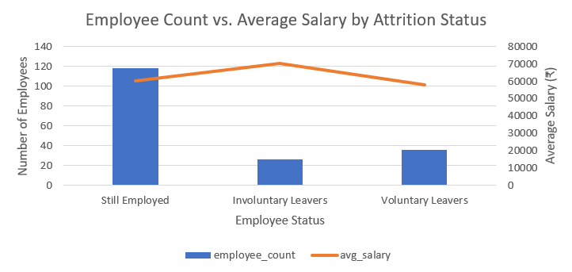
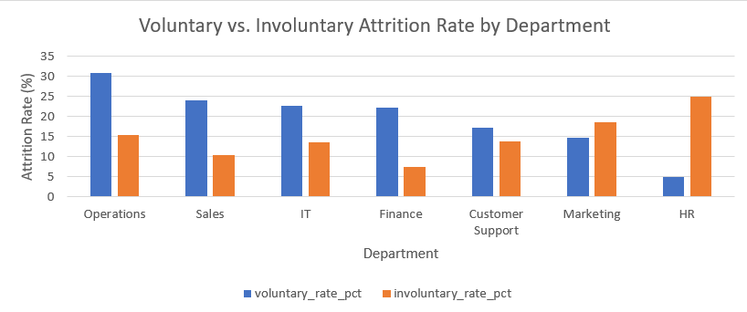
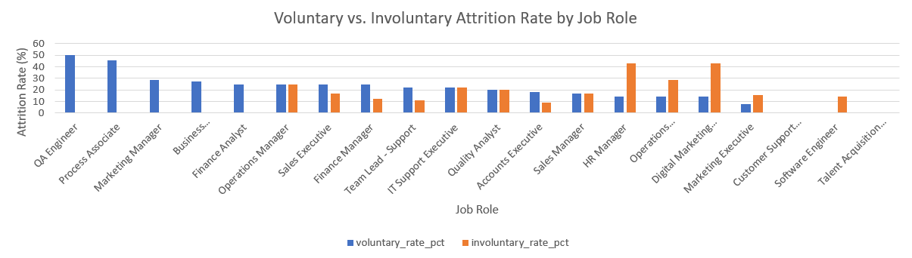
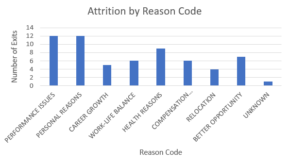
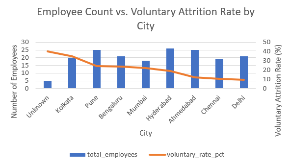
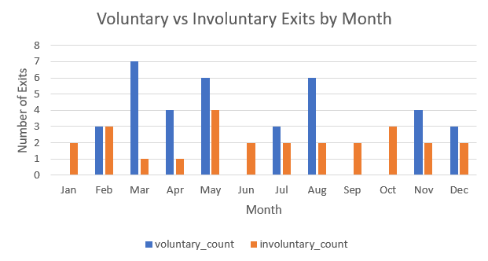

# Employee Attrition & Compensation Analytics

Analysis of employee attrition patterns across departments, roles, pay, location,
and timing to identify where and why employees are leaving, and whether they're
leaving voluntarily or being let go.

## Business Problem

HR wanted to understand attrition beyond a single company-wide number: which
departments and roles are losing people, whether pay is a driver, whether certain
cities show higher voluntary exit rates, and what reasons employees actually cite
when they leave — split by voluntary vs. involuntary exits.

## Tools Used
- MySQL / MySQL Workbench (data cleaning, analysis queries)
- Microsoft Excel (charts, dashboard)

## Data
- 180 employees, 62 attrition events (synthetic dataset built for this project)
- Columns: department, job role, city, hire date, base salary, age, event date,
  event type (Resigned/Terminated), reason code
- Data required cleaning: inconsistent casing and whitespace across department,
  city, and reason code fields; duplicate employee records (15 removed);
  negative and blank salary values; mixed date formats

## Process
1. Cleaned and standardized raw data in MySQL (staging tables → final tables)
2. Ran analysis queries to break down attrition by pay, department, role, city,
   reason, and timing
3. Built 6 charts in Excel summarizing the findings

## Key Insights

- **Pay vs. Attrition:** Resigning employees earned slightly less on average,
  but terminated employees earned the most — pay alone doesn't explain attrition
- **Department:** Operations attrition is voluntary-dominant; HR attrition is
  involuntary-dominant
- **Role:** QA Engineer has the highest voluntary attrition rate; Digital
  Marketing Specialist and HR Manager have the highest involuntary rates —
  the pattern is role-specific, not department-wide
- **Reason Codes:** Performance Issues is the top cited reason (12 of 62 exits),
  but splits mostly voluntary (10 resigned vs. 2 terminated) — suggesting
  disengagement or burnout rather than being let go
- **City:** Kolkata has the highest voluntary attrition rate, Delhi the lowest,
  across 8 cities with comparable employee counts (18–26 each)
- **Timing:** Voluntary exits cluster in March, May, and August

## Screenshots













## Limitations / What I'd Do Differently
- Dataset is synthetic, built to practice realistic data-cleaning scenarios
- "Unknown" reason code (1 exit) excluded from reason-code analysis due to
  negligible sample size
- "Unknown" city (5 employees) excluded from city analysis for the same reason

## Repo Structure
```
01_Raw_Data/
02_Working_Files/
03_Dashboards_Report/    → Employee_Attrition_Analysis.xlsx
04_Documentation/        → README.md
```
